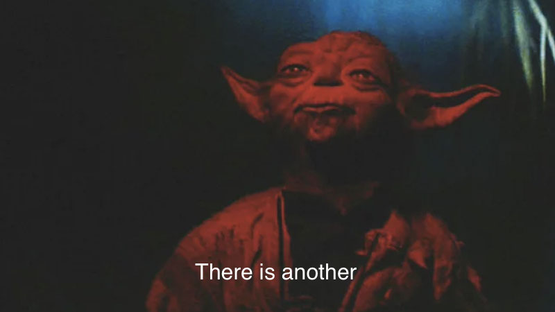

There seems to be this online trend towards writing and there have been hundreds of books & articles about writing. How to write, what to write, why to write, etc. [[1]](#resources)  And I’m totally on for all of it!
At the same time, it seems to me that there’s one thing missing. They all usually talk about two forms of writing, fiction and nonfiction.

The third form of writing I’m talking about is Journaling. More specifically stream-of-consciousness Journaling. It is hands down the best habit I’ve picked up last year! Essentially it’s the process of writing down your thoughts. It’s like a brain dump. I believe it’s one of the most important forms of writing you can do to improve yourself. Not only does it have all the benefits of the previous two, but more! Like,

### Self-reflection
There’s something about transfer of information from one lobe of your brain to the other that causes you to be self reflective. It allows you to see you from a third person’s point of view.

### Brain dump
Consistently writing down your thoughts empties your brain of all the random thoughts. You have essentially done an information transfer from your brain to a computer (or a book!). You now have a clean slate to work on things that you want to work on :)

### Refined Thinking
When you start doing this more often, you’ll see a pattern of thoughts, and you’ll observe them, tear them apart, mix them, create new ones, etc. It allows you to see your thoughts from different angles and poke holes in your own thinking!

### Calm
Journaling is a cathartic exercise. You see an instant sense of relief. All these thoughts that were clogging up your thinking are now gone and you become more calmer and clearer. I’ve also noticed that the physical medium has a way better effect than a digital one. i.e. writing down your thoughts on a paper has more cathartic effect than a computer.

I highly encourage you to give it a try.

All you have to do is,

- Open a text editor on your computer OR Pick up a Pen and a Paper.
- Write down your thoughts as they occur.

Let me know how it goes!

Akash

### Resources

#### Articles/Books/Blogs on writing:

##### Books

- [On Writing Well - by William Zinsser](https://www.amazon.com/dp/0060891548)
- [On Writing - by Stephen King](https://www.amazon.com/Writing-10th-Anniversary-Memoir-Craft/dp/1439156816)
- [The War of Art - by Steven Pressfield](https://www.amazon.com/dp/0446691437)
- [Turning Pro - by Steven Pressfield](https://www.amazon.com/dp/1936891034)

##### Derek Sivers

- [My writing process](https://sivers.org/7)
- [Benefits of a daily diary and topic journals](https://sivers.org/dj)
- [Writing daily, but posting when ready](https://sivers.org/nod)

##### Paul Graham

- [Writing,  Briefly](http://www.paulgraham.com/writing44.html)
- [Write Like You Talk](http://www.paulgraham.com/talk.html)
- [Writing and Speaking](http://www.paulgraham.com/speak.html)
- [How to Write Usefully](http://paulgraham.com/useful.html)

##### David Perell

- [The ultimate guide to writing online](https://www.perell.com/blog/the-ultimate-guide-to-writing-online)
- [Why you should write](https://www.perell.com/blog/why-you-should-write)

#### Apps I use (or people have recommended) for writing:

- [Drafts](https://getdrafts.com)

  I love this! It's simplicity allows me to focus on just one thing i.e. writing, at the same time being feature-rich to satisfy all my needs and more!

- [Notion](https://notion.so)

  I use this for all the general stuff

- [Bear](https://bear.app)

  People love this

- [Google Docs](https://docs.new)

  I use it to quickly do a spell/semantics check before publishing.

  <i>pro-tip: use [docs.new](https://docs.new) to quickly open a new google doc</i>

- [Visual Studio Code](https://visualstudio.microsoft.com)

  This is where the posts land before being published.